# Container Orchestration Architecture - Visual Diagrams

This document provides visual representations of the Kubernetes orchestration architecture for the Anti-Hate Platform.

---

## Diagram 1: Multi-Cluster Hierarchy

```mermaid
graph TD
    %% International Level - Stadium shape for prominence
    INTERNATIONAL(["🌍 INTERNATIONAL COORDINATION CLUSTER<br/>────────────────────<br/>International Control Plane<br/>Smart Feed Engine<br/>Model Distribution<br/>UN Reporting"])
    
    %% Ellipsis - More countries on sides (circles)
    ELLIPSIS_COUNTRIES_L(("⋯"))
    ELLIPSIS_COUNTRIES_R(("⋯"))
    
    %% National Level - Rounded rectangles
    NATIONAL_USA("🇺🇸 USA<br/>National<br/>Cluster")
    NATIONAL_RUS("🇷🇺 Russia<br/>National<br/>Cluster")
    NATIONAL_CHN("🇨🇳 China<br/>National<br/>Cluster")
    NATIONAL_IND("🇮🇳 India<br/>National<br/>Cluster")
    NATIONAL_BRA("🇧🇷 Brazil<br/>National<br/>Cluster")
    NATIONAL_ZAF("🇿🇦 South Africa<br/>National<br/>Cluster")
    NATIONAL_EGY("🇪🇬 Egypt<br/>National<br/>Cluster")
    
    %% Geography Level - Circles for geographies, rounded for ellipses
    ELLIPSIS_GEO_USA("⋯ more<br/>geographies")
    GEOGRAPHY_NY(("📍 New York<br/>Geography"))
    
    ELLIPSIS_GEO_RUS("⋯ more<br/>geographies")
    GEOGRAPHY_MSK(("📍 Moscow<br/>Geography"))
    
    ELLIPSIS_GEO_CHN("⋯ more<br/>geographies")
    GEOGRAPHY_BJ(("📍 Beijing<br/>Geography"))
    
    ELLIPSIS_GEO_IND("⋯ more<br/>geographies")
    GEOGRAPHY_MUM(("📍 Mumbai<br/>Geography"))
    
    %% Local Level - Rounded rectangles for locals, rounded for ellipses
    ELLIPSIS_LOC_NY("⋯ more<br/>local")
    LOCAL_NYC("💾 NYC<br/>Local")
    
    ELLIPSIS_LOC_MSK("⋯ more<br/>local")
    LOCAL_MSK("💾 Moscow<br/>Local")
    
    ELLIPSIS_LOC_BJ("⋯ more<br/>local")
    LOCAL_SHA("💾 Shanghai<br/>Local")
    
    ELLIPSIS_LOC_MUM("⋯ more<br/>local")
    LOCAL_DEL("💾 Delhi<br/>Local")
    
    %% International to National (with ellipses for more countries)
    INTERNATIONAL ==>|Config & Models| ELLIPSIS_COUNTRIES_L
    INTERNATIONAL ==>|Config & Models| NATIONAL_USA
    INTERNATIONAL ==>|Config & Models| NATIONAL_RUS
    INTERNATIONAL ==>|Config & Models| NATIONAL_CHN
    INTERNATIONAL ==>|Config & Models| NATIONAL_IND
    INTERNATIONAL ==>|Config & Models| NATIONAL_BRA
    INTERNATIONAL ==>|Config & Models| NATIONAL_ZAF
    INTERNATIONAL ==>|Config & Models| NATIONAL_EGY
    INTERNATIONAL ==>|Config & Models| ELLIPSIS_COUNTRIES_R
    
    %% National to Geography (showing multiple per country)
    NATIONAL_USA -->|Coordination| ELLIPSIS_GEO_USA
    NATIONAL_USA -->|Coordination| GEOGRAPHY_NY
    
    NATIONAL_RUS -->|Coordination| ELLIPSIS_GEO_RUS
    NATIONAL_RUS -->|Coordination| GEOGRAPHY_MSK
    
    NATIONAL_CHN -->|Coordination| ELLIPSIS_GEO_CHN
    NATIONAL_CHN -->|Coordination| GEOGRAPHY_BJ
    
    NATIONAL_IND -->|Coordination| ELLIPSIS_GEO_IND
    NATIONAL_IND -->|Coordination| GEOGRAPHY_MUM
    
    %% Geography to Local (showing multiple per geography)
    GEOGRAPHY_NY -->|Tasks| ELLIPSIS_LOC_NY
    GEOGRAPHY_NY -->|Tasks| LOCAL_NYC
    
    GEOGRAPHY_MSK -->|Tasks| ELLIPSIS_LOC_MSK
    GEOGRAPHY_MSK -->|Tasks| LOCAL_MSK
    
    GEOGRAPHY_BJ -->|Tasks| ELLIPSIS_LOC_BJ
    GEOGRAPHY_BJ -->|Tasks| LOCAL_SHA
    
    GEOGRAPHY_MUM -->|Tasks| ELLIPSIS_LOC_MUM
    GEOGRAPHY_MUM -->|Tasks| LOCAL_DEL
    
    %% Data Flow (Bottom-Up)
    LOCAL_NYC -.->|Metadata| GEOGRAPHY_NY
    ELLIPSIS_LOC_NY -.->|Metadata| GEOGRAPHY_NY
    
    LOCAL_MSK -.->|Metadata| GEOGRAPHY_MSK
    ELLIPSIS_LOC_MSK -.->|Metadata| GEOGRAPHY_MSK
    
    LOCAL_SHA -.->|Metadata| GEOGRAPHY_BJ
    ELLIPSIS_LOC_BJ -.->|Metadata| GEOGRAPHY_BJ
    
    LOCAL_DEL -.->|Metadata| GEOGRAPHY_MUM
    ELLIPSIS_LOC_MUM -.->|Metadata| GEOGRAPHY_MUM
    
    GEOGRAPHY_NY -.->|Smart Feeds| NATIONAL_USA
    ELLIPSIS_GEO_USA -.->|Smart Feeds| NATIONAL_USA
    
    GEOGRAPHY_MSK -.->|Smart Feeds| NATIONAL_RUS
    ELLIPSIS_GEO_RUS -.->|Smart Feeds| NATIONAL_RUS
    
    GEOGRAPHY_BJ -.->|Smart Feeds| NATIONAL_CHN
    ELLIPSIS_GEO_CHN -.->|Smart Feeds| NATIONAL_CHN
    
    GEOGRAPHY_MUM -.->|Smart Feeds| NATIONAL_IND
    ELLIPSIS_GEO_IND -.->|Smart Feeds| NATIONAL_IND
    
    NATIONAL_USA -.->|National Feeds| INTERNATIONAL
    NATIONAL_RUS -.->|National Feeds| INTERNATIONAL
    NATIONAL_CHN -.->|National Feeds| INTERNATIONAL
    NATIONAL_IND -.->|National Feeds| INTERNATIONAL
    NATIONAL_BRA -.->|National Feeds| INTERNATIONAL
    NATIONAL_ZAF -.->|National Feeds| INTERNATIONAL
    NATIONAL_EGY -.->|National Feeds| INTERNATIONAL
    ELLIPSIS_COUNTRIES_L -.->|Feeds| INTERNATIONAL
    ELLIPSIS_COUNTRIES_R -.->|Feeds| INTERNATIONAL
    
    %% Styling
    classDef internationalStyle fill:#1e3a8a,stroke:#1e40af,stroke-width:3px,color:#fff
    classDef nationalStyle fill:#7c3aed,stroke:#6d28d9,stroke-width:2px,color:#fff
    classDef geographyStyle fill:#059669,stroke:#047857,stroke-width:2px,color:#fff
    classDef localStyle fill:#dc2626,stroke:#b91c1c,stroke-width:2px,color:#fff
    classDef ellipsisStyle fill:#666,stroke:#444,stroke-width:1px,color:#fff,stroke-dasharray:5
    
    class INTERNATIONAL internationalStyle
    class NATIONAL_USA,NATIONAL_RUS,NATIONAL_CHN,NATIONAL_IND,NATIONAL_BRA,NATIONAL_ZAF,NATIONAL_EGY nationalStyle
    class GEOGRAPHY_NY,GEOGRAPHY_MSK,GEOGRAPHY_BJ,GEOGRAPHY_MUM geographyStyle
    class LOCAL_NYC,LOCAL_MSK,LOCAL_SHA,LOCAL_DEL localStyle
    class ELLIPSIS_COUNTRIES_L,ELLIPSIS_COUNTRIES_R,ELLIPSIS_GEO_USA,ELLIPSIS_GEO_RUS,ELLIPSIS_GEO_CHN,ELLIPSIS_GEO_IND,ELLIPSIS_LOC_NY,ELLIPSIS_LOC_MSK,ELLIPSIS_LOC_BJ,ELLIPSIS_LOC_MUM ellipsisStyle
```

Mermaid Source Code

---

## Diagram 2: Local Node - Pod Architecture

---

## Diagram 3: Service Mesh (Istio) - Traffic Flow

---

## Diagram 4: Auto-scaling Flow

---

## Diagram 5: Data Flow - Observation to Analysis

---

## Diagram 6: Storage Architecture

---

## Diagram 7: GitOps Deployment Flow

---

## Diagram 8: Monitoring & Observability Stack

---

## Diagram 9: Security Boundaries

---

## Diagram 10: Disaster Recovery Flow

---

## Summary

These diagrams illustrate:

1. **Multi-Cluster Hierarchy**: How clusters are organized from Local to International
2. **Pod Architecture**: The internal structure of a Local node
3. **Service Mesh**: How Istio manages secure communication
4. **Auto-scaling**: The complete auto-scaling workflow
5. **Data Flow**: From observation through analysis to metadata sync
6. **Storage**: PostgreSQL StatefulSet with HA and backups
7. **GitOps**: How code changes are deployed automatically
8. **Observability**: The complete monitoring stack
9. **Security**: Layered security boundaries
10. **Disaster Recovery**: Automated recovery procedures

All diagrams use Mermaid syntax and will render correctly in GitHub, GitLab, and most modern markdown viewers.
