# Functional Requirements Sequence Diagrams

This document provides PlantUML sequence diagrams illustrating the key interactions and flows for each functional requirement of the Global Anti-Hate Speech Platform (GAHSP).

---

## 1. Data Ingestion & Scraping Module

### 1.1. Social Media Integration (API-Driven)

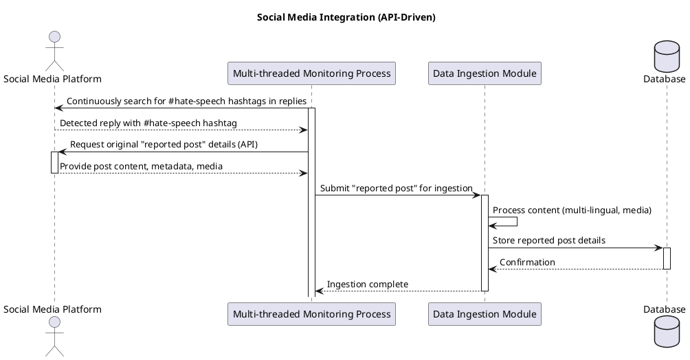

### 1.2. Web Page Scraping

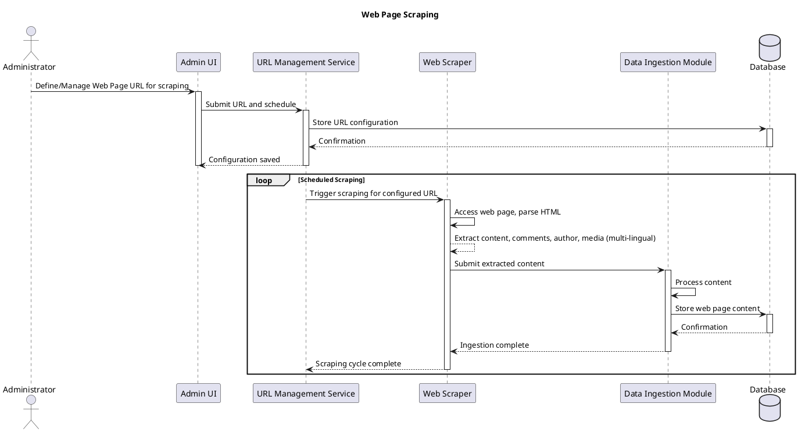

---

## 2. Hate Speech Identification & Trigger Mechanism

### 2.6. Multi-threaded Monitoring Process (Triggering Analysis)

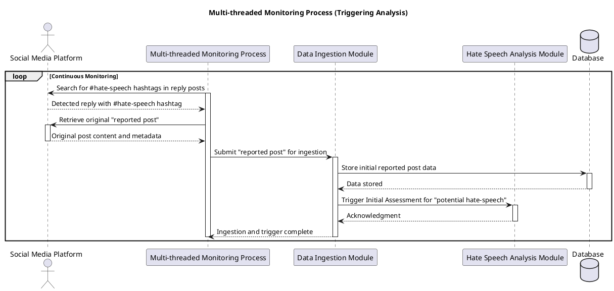

---

## 3. Anonymous User Submission & Multi-Modal Content Ingestion Module (CORE FEATURE)

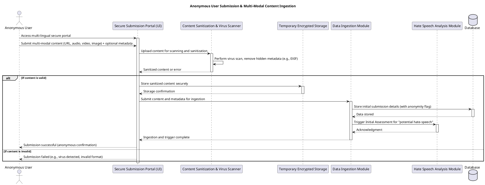

---

## 4. Hate Speech Analysis Module (Enhanced for Multi-Modal & Multi-Lingual)

### 4.1. Initial Assessment & Flagging

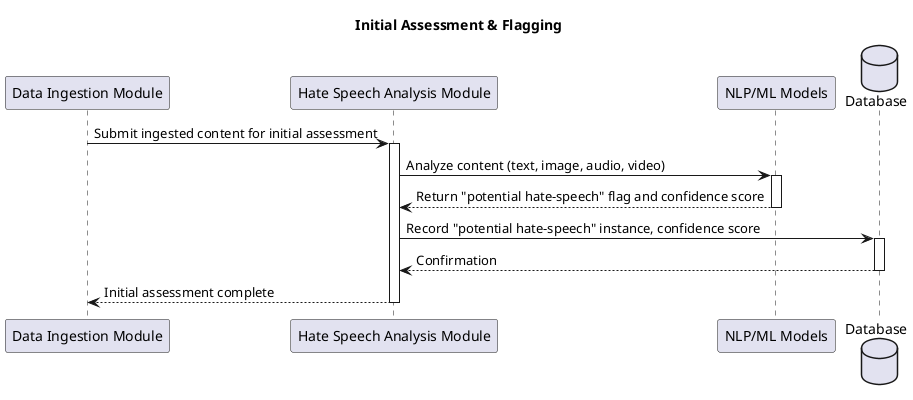

### 4.2. International Anti-Hate Speech Trustees Review & Voting

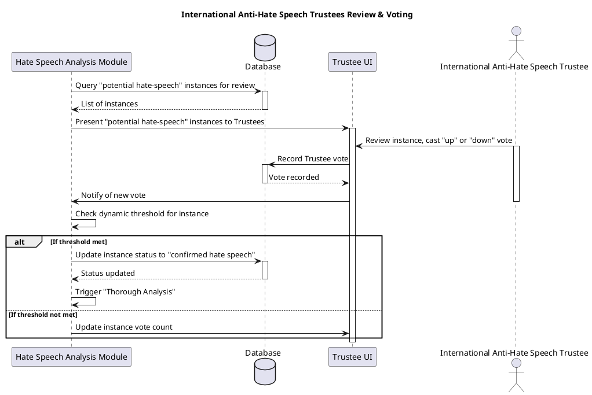

### 4.3. Thorough Analysis for Confirmed Hate Speech

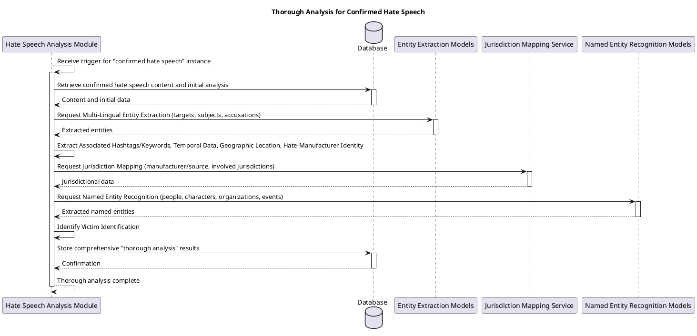

---

## 5. Database Management Module (High-Level Interactions)

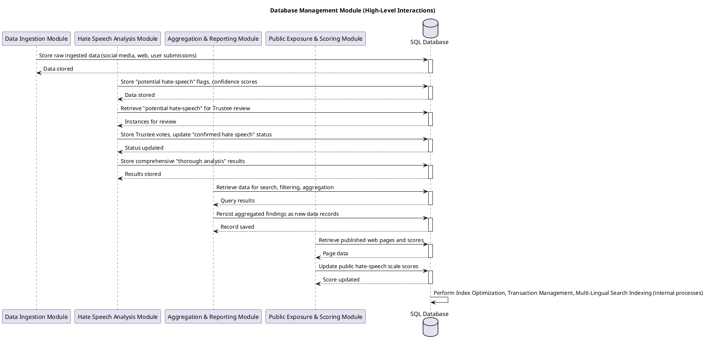

---

## 6. Aggregation & Reporting Module

### 6.3. Search & Filtering

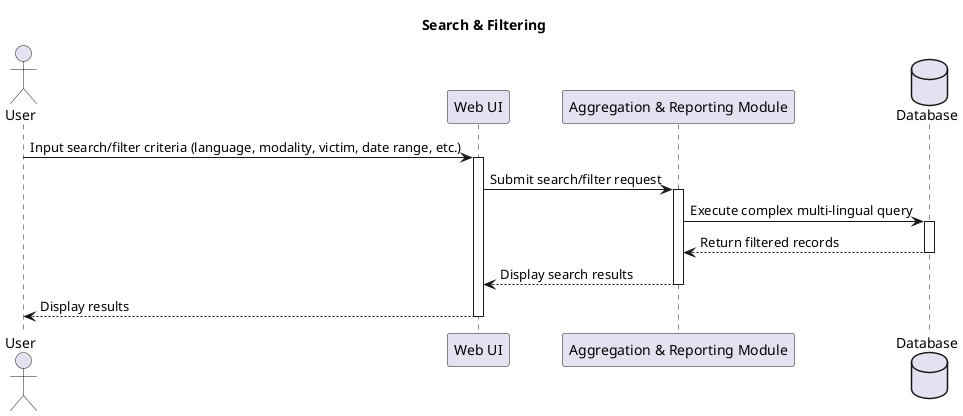

### 6.4. Aggregation Workbench (Interactive Aggregation)

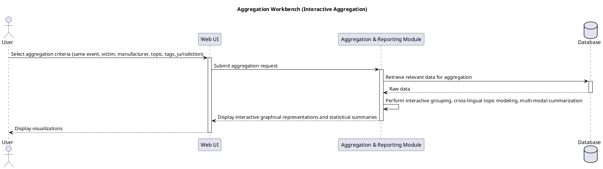

### 6.5. Aggregation Output Options (Generate Report)

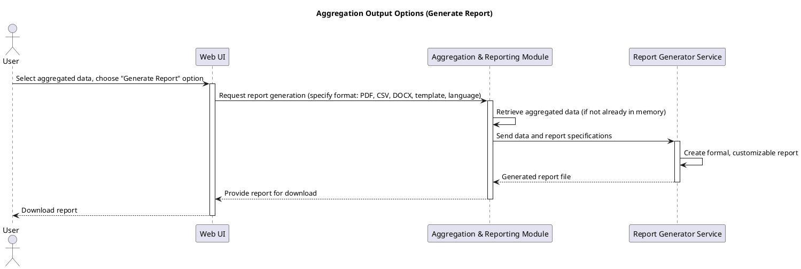

### 6.5. Aggregation Output Options (Display as Web Page)

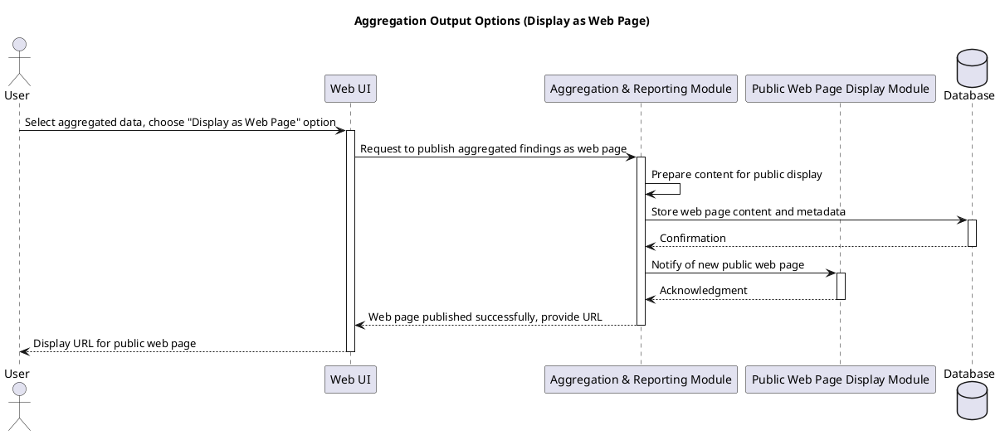

---

## 7. Public Exposure & Scoring Module (New)

### 7.2. Public Hate-Speech Scale Scoring

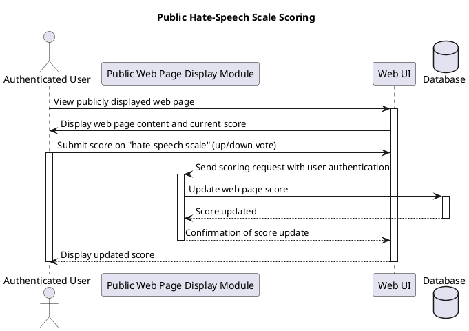

### 7.3. Dynamic Listing & Reporting (Top 10 for UN Consideration)

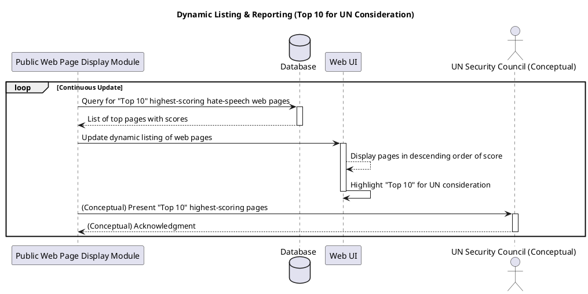

---

## 8. Data Replication & Recovery Module (Globally Distributed & Secure)

### 8.1. Real-time Replication (Geographic Redundancy)

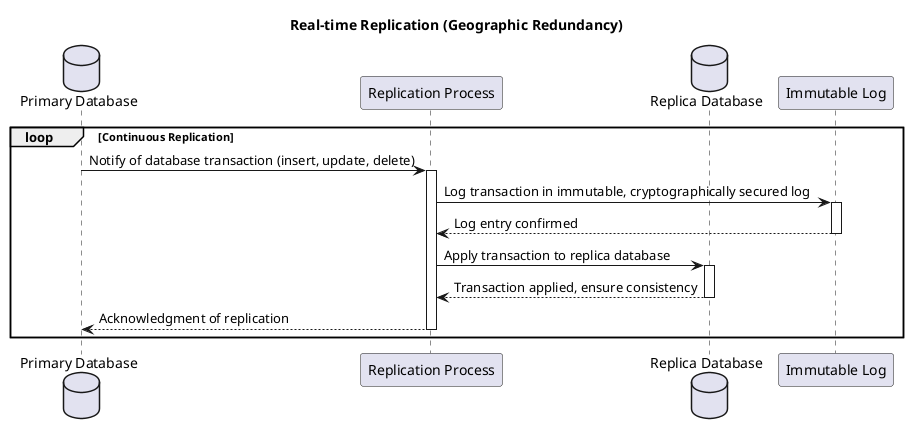

### 8.3. Point-in-Time Recovery & 8.4. Special Case Backup for Rollback & Legal Archiving

```plantuml
@startuml
title Point-in-Time Recovery & Special Case Backup

actor Administrator as Admin
participant "Recovery Tool" as RT
database "Primary Database" as PrimaryDB
database "Replica Database" as ReplicaDB
participant "Immutable Log" as ILog
participant "Backup Service" as BS
participant "Legal Archive Storage" as LAS

Admin -> RT: Initiate Point-in-Time Recovery to specific transaction point
activate RT
RT -> ILog: Retrieve transaction log up to specified point
activate ILog
ILog --> RT: Transaction log data
deactivate ILog
RT -> PrimaryDB: Roll back Primary Database to specified point
activate PrimaryDB
PrimaryDB --> RT: Rollback complete
deactivate PrimaryDB

RT -> BS: Request Pre-Synchronization Backup of PrimaryDB (distinct state)
activate BS
BS -> PrimaryDB: Read current state
BS -> BS: Create cryptographically signed backup
BS -> LAS: Store PrimaryDB backup for legal archiving
activate LAS
LAS --> BS: Backup stored
deactivate LAS
BS --> RT: PrimaryDB backup complete
deactivate BS

RT -> ReplicaDB: Roll back Replica Database to specified point
activate ReplicaDB
ReplicaDB --> RT: Rollback complete
deactivate ReplicaDB

RT -> BS: Request Pre-Synchronization Backup of ReplicaDB (distinct state)
activate BS
BS -> ReplicaDB: Read current state
BS -> BS: Create cryptographically signed backup
BS -> LAS: Store ReplicaDB backup for legal archiving
activate LAS
LAS --> BS: Backup stored
deactivate LAS
BS --> RT: ReplicaDB backup complete
deactivate BS

RT -> RP: Re-enable Replication Process (if it was paused)
activate RP
RP --> RT: Replication re-enabled
deactivate RP
RT --> Admin: Recovery and archiving complete
deactivate RT
@enduml
